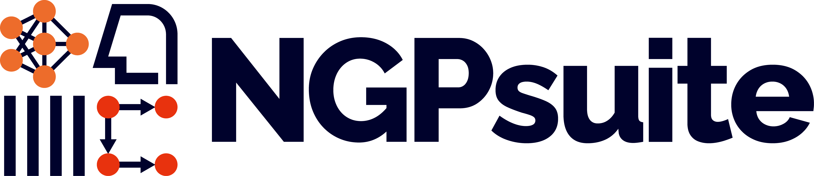
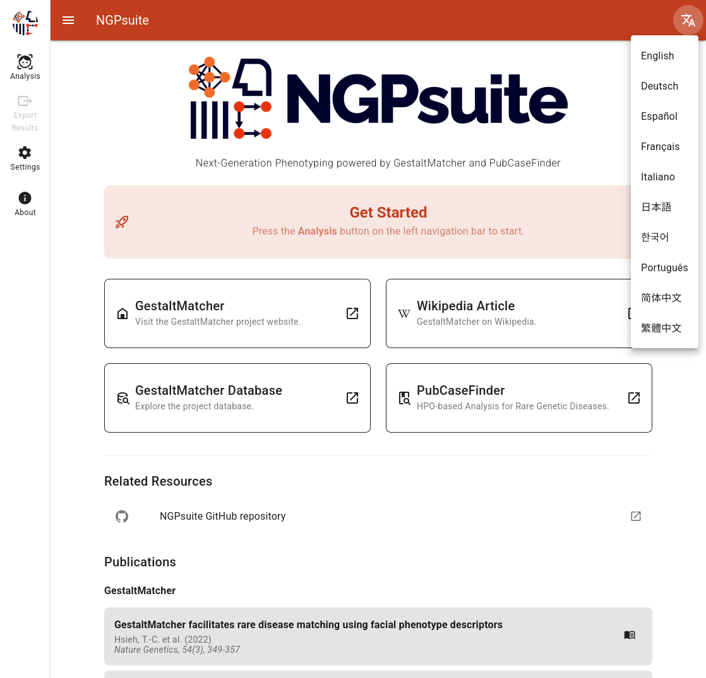
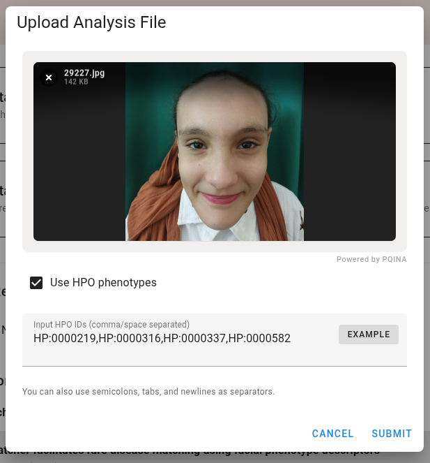
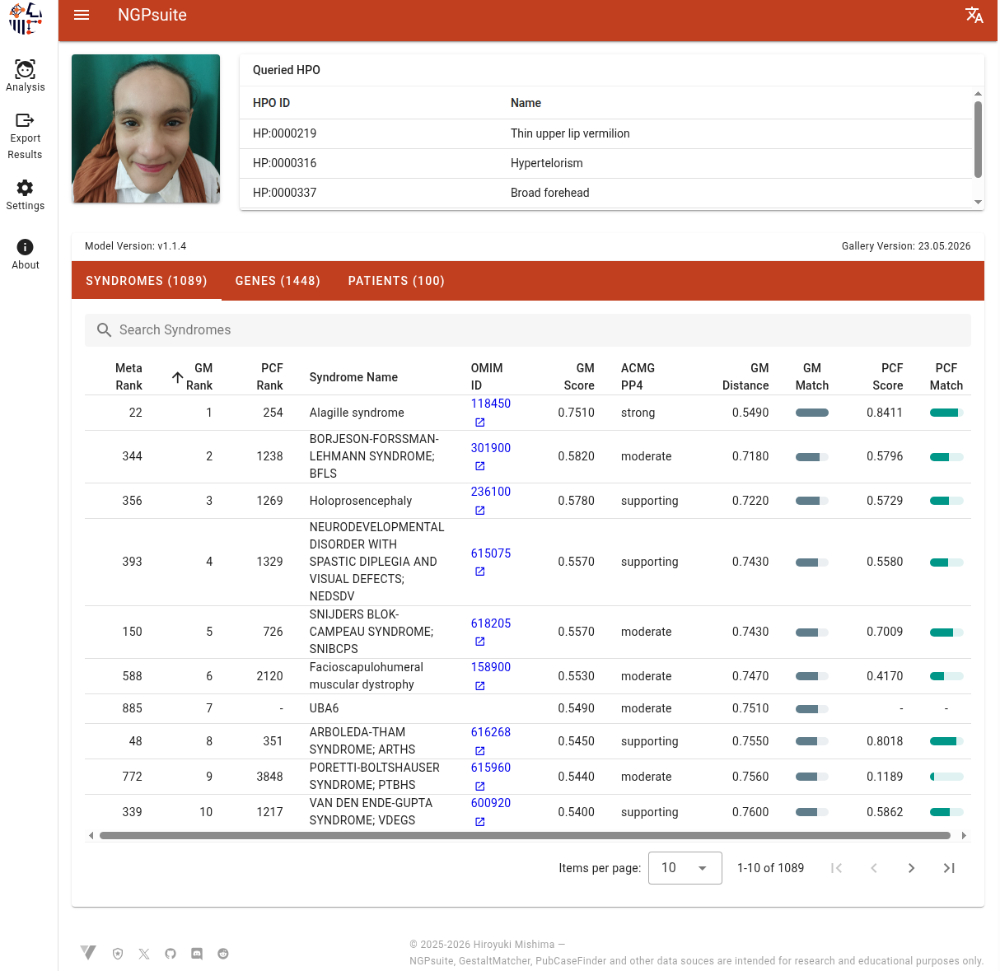

# **NGPsuite**

*This is a Japanese translation of [README.md](README.md). The English README.md is the original.*

*Next-Generation Phenotyping powered by GestaltMatcher and PubCaseFinder*



## **目次**

1. [はじめに](#はじめに)
2. [エンドユーザー向け（インストールと利用）](#エンドユーザー向けインストールと利用)
3. [開発者向け](#開発者向け)
4. [技術スタック](#技術スタック)
5. [ライセンス](#ライセンス)
6. [謝辞](#謝辞)
7. [著者](#著者)
8. [参考文献](#参考文献)

----

<p align="center">
  
  
  
</p>
<p align="center"><em>画像提供: Dr. Ibrahim Abdelrazek / GestaltMatcher Database https://db.gestaltmatcher.org/patients/15727</em></p>

----
## **はじめに**

**NGPsuite** は、稀少疾患の診断を支援する Web アプリケーションです。
画像から得られる顔貌表現型の解析と、臨床情報（HPO ID）を統合し、
臨床遺伝医や医学研究者に総合的な視点を提供します。

本アプリケーションは、画像ベースの予測に [GestaltMatcher](https://www.gestaltmatcher.org/) の解析力を用い、
さらに [PubCaseFinder](https://pubcasefinder.dbcls.jp/?lang=en) による HPO ベースの表現型解析を組み合わせることで、
次世代表現型解析（next-generation phenotyping）へのマルチモーダルなアプローチを実現します。

***NGPsuite、GestaltMatcher、PubCaseFinder、および外部情報源は、研究および教育目的のみを想定しています***。

----
## **エンドユーザー向け（インストールと利用）**

この節では、アプリケーションを実行したいユーザー向けの手順を説明します。
フロントエンドの開発環境は不要です。

### **前提条件**

* システムに Docker がインストールされていること。

### **1. アプリケーションの入手**

最新リリースの zip ファイルをダウンロードし、展開してください。

### **2. 必要なモデルとデータ**

倫理的な理由により、学習済みモデルは一般公開されていません。\
[GestaltMatcher Database (GMDB)](https://db.gestaltmatcher.org/) へのアクセスが許可された後、学習済みモデルの重みとアノテーションもリクエストできます。

必要なファイルを入手したら、次のとおり正しいディレクトリに配置してください。

1. 事前学習済み特徴抽出（エンコーダ）モデル
次のファイルを `backend/saved_models/` ディレクトリに配置します:
* `Resnet50_Final.pth`（顔アライメント用）
* `glint360k_r50.onnx`（モデル a 用のベース事前学習モデル）
* `glint360k_r100.onnx`（モデル b 用のベース事前学習モデル）

2. 学習済み特徴空間モデル（ギャラリー）
次のファイルを `backend/saved_models/` ディレクトリに配置します:
* `s1_glint360k_r50_512d_gmdb__v1.1.4_bs64_size112_channels3_last_model.pth`（モデル a）
* `s2_glint360k_r100_512d_gmdb__v1.1.4_bs128_size112_channels3_last_model.pth`（モデル b）

3. ギャラリーエンコーディング用アノテーション
次のファイルを `backend/data/gallery_encodings/` ディレクトリに配置します:
* `GMDB_gallery_encodings_23052026_v1.1.4_service.pkl`

4. GestaltMatcher-Arc v1.1.4 用の追加データ
次のファイルを `backend/data/` ディレクトリに配置します:
* `transformation_probabilities_07052025.csv`（PP4 用の症候群変換確率）
* `patient_metadata_2026-05-23_mondo.p`（疾患／遺伝子メタデータ。疾患は MONDO ID でキー付け）

5. MONDO オントロジー（リポジトリ同梱）
次のファイルは `backend/mondo/` 配下で管理されており（患者データは含みません）、別途ダウンロードする必要はありません:
* `mondo-international.obo.gz`（ギャラリー疾患のラベルと祖先階層）

本製品には Mondo Disease Ontology (Mondo) の international edition（[mondo.monarchinitiative.org](https://mondo.monarchinitiative.org/)）が含まれます。Mondo のライセンスは [CC BY 4.0](https://creativecommons.org/licenses/by/4.0/) です。[謝辞](#謝辞)も参照してください。

最終的なファイル構成は次のようになります:

```
ngp-suite/
└── backend/
    ├── data/
    │   ├── gallery_encodings/
    │   │   └── GMDB_gallery_encodings_23052026_v1.1.4_service.pkl
    │   ├── transformation_probabilities_07052025.csv
    │   └── patient_metadata_2026-05-23_mondo.p
    ├── mondo/
    │   └── mondo-international.obo.gz
    ├── saved_models/
    │   ├── Resnet50_Final.pth
    │   ├── glint360k_r50.onnx
    │   ├── glint360k_r100.onnx
    │   ├── s1_glint360k_r50_512d_gmdb__v1.1.4_bs64_size112_channels3_last_model.pth
    │   └── s2_glint360k_r100_512d_gmdb__v1.1.4_bs128_size112_channels3_last_model.pth
    └── ... (その他のバックエンドファイル)
```

### **3. アプリケーションのビルドと実行**

backend ディレクトリに移動し、Docker Compose でサービスをビルドして起動します。

```
cd backend  
sudo docker compose build  
sudo docker compose up -d     # `-d` を付けなければ、コンソールでログを確認できます。
```

初回起動時は、API サービスがモデルを読み込むため、約 90 秒かかることがあります。

#### **GPU / CUDA に関する注意**

NGPsuite（Web API）の Docker デプロイは **CPU** 上で動作します。ホストに GPU があっても、推論には GPU を使いません。エンドユーザーは CUDA、NVIDIA ドライバ、その他の GPU 関連セットアップを必要としません。

<details>
<summary><strong>開発者向け: 任意の CUDA 対応イメージビルド</strong></summary>

既定では、API イメージは **CPU 専用** の PyTorch をインストールします（イメージが小さく、NVIDIA パッケージ依存がありません）。

意図的にイメージ内へ CUDA 対応の PyTorch を入れたい場合（実験や将来の GPU 利用向け）は、次のようにビルドします:

```
cd backend
sudo docker compose build --build-arg USE_CUDA=1
# 任意: キャッシュなしで再ビルドする場合
# sudo docker compose build --no-cache --build-arg USE_CUDA=1
```

注意事項:

* 変更されるのはインストールされる PyTorch の wheel のみです。アプリケーションコードを CUDA 利用に変更しない限り、現行の Web API は CPU で推論します。
* CUDA ビルドはサイズが大きく、時間がかかり、`pip install` 時により多くのディスク容量を必要とします。
* 実行時に GPU を使うには、別途ホスト側に NVIDIA ドライバと NVIDIA Container Toolkit が必要です。これは本ビルドフラグとは独立です。

要件ファイル:

* `backend/requirements_docker.txt` — 既定（CPU）ビルド用の共通依存。PyTorch / torchvision は Dockerfile 内で公式の CPU wheel インデックスからインストールされます
* `backend/requirements_docker_cuda.txt` — 同じ依存に加え、CUDA オプトインビルド用の `torch`

Dockerfile は `torch==2.3.1` と `torchvision==0.18.1` を pip の constraints ファイルで固定し、他パッケージが PyPI から CUDA ビルドへ上げないようにしています。

</details>

### **4. アプリケーションへのアクセス**

起動が完了したら、Web ブラウザで次の URL を開いてください:  
`https://localhost`

#### **初回アクセス時のセキュリティ警告**

*NGPsuite* に初めてアクセスすると、自己署名証明書の使用により、ブラウザがセキュリティ警告を表示することがあります。これは想定どおりの動作です。続行するには、「詳細設定」や「続行…」などのボタンをクリックし、証明書を受け入れてください。

## **開発者向け**

この節は、プロジェクトへの貢献を希望する開発者向けです。

### **初期セットアップ**

1. **フロントエンド依存関係:**
```
   cd frontend  
   npm install
```

2. バックエンドデータ:  
   「エンドユーザー向け」節の手順 2 に従い、必要な学習済みモデルを backend ディレクトリに配置してください。

### **開発モードでの実行**

1. **フロントエンド開発サーバの起動:**
```
   cd frontend  
   npm run dev
```

2. バックエンド API サーバの起動:  
```
   別ターミナルで:  
   cd backend  
   sudo docker compose up --build
```

   フロントエンドはホットリロード有効で `http://localhost:3000` から利用でき、
   Docker 内で動作する API サーバと通信します。

### **フロントエンドのビルド**

本番用フロントエンドをビルドし、backend の static ディレクトリへコピーするには、
プロジェクトルートから次のスクリプトを実行します:

`./build-frontend.sh`

## **技術スタック**

* **Frontend:** [](https://vuejs.org/)
[](https://www.typescriptlang.org/)
[](https://pinia.vuejs.org/)
[](https://github.com/intlify/vue-i18n-next)
[](https://github.com/axios/axios)
[](https://vuetifyjs.com/)
[](https://pqina.nl/filepond/)
* **Backend:** [](https://www.python.org/)
[](https://fastapi.tiangolo.com/)
* **Infrastructure:** [](https://www.docker.com/)
[](https://www.nginx.com/)

## **ライセンス**

[](http://creativecommons.org/licenses/by-nc/4.0/)


本プロジェクトは **Creative Commons Attribution-NonCommercial 4.0 International License** の下で提供されています。
詳細は [LICENSE.md](LICENSE.md) を参照してください。

## **謝辞**

本プロジェクトのバックエンドサービスは、
[GestaltMatcher](https://www.gestaltmatcher.org/) およびその [リポジトリ](https://github.com/igsb/GestaltMatcher-Arc/) の成果に基づいています。
バックエンドは PubCaseFinder の API も利用しています（[詳細](https://pubcasefinder.dbcls.jp/api)）。分野の基盤を築かれた皆様に感謝します。

本製品には Mondo Disease Ontology (Mondo) の international edition
（[mondo.monarchinitiative.org](https://mondo.monarchinitiative.org/)）が含まれます。Mondo のライセンスは
[CC BY 4.0](https://creativecommons.org/licenses/by/4.0/) です。オントロジーファイルは `backend/mondo/` 配下に同梱されています。

本プロジェクトの開発に大きく寄与した貴重な議論と支援に対し、[DBCLS BioHackathon 2025](https://2025.biohackathon.org/)（2025年9月14–20日、三重、日本）および [DBCLS BioHackathon 2026](https://2026.biohackathon.org/)（2026年9月13–19日、愛媛、日本）の参加者および運営の皆様に感謝します。

## **著者**

* **Hiroyuki Mishima**（三嶋 博之）*
* 長崎大学原爆後障害医療研究所 人類遺伝学研究分野*
* [Research Map Profile](https://researchmap.jp/misshie?lang=en)

## 参考文献
### GestaltMatcher
1. **GestaltMatcher**: Hsieh, T.-C. et al. (2022). GestaltMatcher facilitates rare disease matching using facial phenotype descriptors. Nature Genetics, 54(3), 349-357. [https://www.nature.com/articles/s41588-021-01010-x](https://www.nature.com/articles/s41588-021-01010-x)
2. **GestaltMatcher-Arc**: Hustinx, A. et al. (2023). Improving deep facial phenotyping for ultra-rare disorder verification using model ensembles. 2023 IEEE/CVF Winter Conference on Applications of Computer Vision (WACV). doi:[10.1109/wacv56688.2023.00499](https://openaccess.thecvf.com/content/WACV2023/papers/Hustinx_Improving_Deep_Facial_Phenotyping_for_Ultra-Rare_Disorder_Verification_Using_Model_WACV_2023_paper.pdf)
3. **GestaltMatcher Database**: Lesmann, H. et al. (2024). GestaltMatcher Database - A global reference for facial phenotypic variability in rare human diseases. medRxiv. doi:[10.1101/2023.06.06.23290887](https://www.medrxiv.org/content/10.1101/2023.06.06.23290887v3)

### PubCaseFinder
1. Shin, J., Fujiwara, T., Saitsu, H., & Yamaguchi, A. (2025).Ontology-based expansion of virtual gene panels to improve diagnostic efficiency for rare genetic diseases. BMC medical informatics and decision making, 25(Suppl 1), 59. doi:[10.1186/s12911-025-02910-2](https://doi.org/10.1186/s12911-025-02910-2)
2. Fujiwara, T., Shin, J. M., & Yamaguchi, A. (2022). Advances in the development of PubCaseFinder, including the new application programming interface and matching algorithm. Human mutation, 10.1002/humu.24341. Advance online publication. doi:[10.1002/humu.24341](https://doi.org/10.1002/humu.24341)
3. Yamaguchi, A., Shin, J. M., & Fujiwara, T. (2021, December). Gene Ranking based on Paths from Phenotypes to Genes on Knowledge Graph. In The 10th International Joint Conference on Knowledge Graphs (pp. 131-134). doi:[10.1145/3502223.3502240](https://doi.org/10.1145/3502223.3502240)
4. Fujiwara, T., Yamamoto, Y., Kim, J. D., Buske, O., & Takagi, T. (2018). PubCaseFinder: A case-report-based, phenotype-driven differential-diagnosis system for rare diseases. The American Journal of Human Genetics, 103(3), 389-399. doi:[10.1016/j.ajhg.2018.08.003](https://doi.org/10.1016/j.ajhg.2018.08.003)
