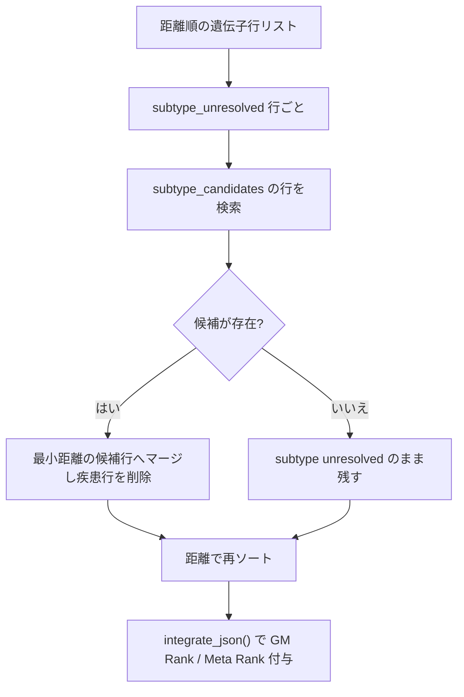

# GENES テーブルの遺伝子解決（実行時処理と表示）

作成日: 2026-09-18
対象リポジトリ: `ngp-suite`
対になるプラン: `gmdb-mondo/plans-ja/2026-09-18-gene-resolution-builder.plan.md`

## 背景

GENES テーブルには、GMDB に原因遺伝子が登録されていない画像に由来する疑似遺伝子行が
2,867 枚分含まれ、`Williams syndrome` のような疾患名が Gene Symbol 欄に出る。GENES の目的は
注目すべき遺伝子リストの提示なので、疾患名の表示は最小限にしたい。

静的に決まる補完（`Kabuki syndrome 1` → KMT2D）は `gmdb-mondo` 側の pickle ビルダーが担う。
本プランは pickle だけでは決められない**実行時の処理**と**表示**を担当する。

- サブタイプ未確定の疾患（`Kabuki syndrome` → KMT2D / KDM6A）は、どちらを採るかがその
  クエリの GM Distance に依存するため実行時に決める
- 解決できなかった行の区別（`gene unresolved` / `subtype unresolved`）を UI に出す
- Entrez ID が無い遺伝子は HGNC へリンクする

## 前提となる pickle 契約

`gmdb-mondo` が pickle に追加するキー（詳細は対になるプラン）。

- `gene_metadata[gid]["gene_status"]`: `gmdb` | `mondo` | `subtype_unresolved` | `gene_unresolved`
- `gene_metadata[gid]["hgnc_id"]`: `HGNC:7133` など。無ければ `None`
- `gene_metadata[gid]["subtype_candidates"]`: `subtype_unresolved` のときのみ。
  `[{"gene_name": "KMT2D", "hgnc_id": "HGNC:7133"}, ...]`
- `gene_level_metadata[image_id][i]["gene_source"]`: `gmdb` | `mondo`

**後方互換**: これらのキーが無い pickle では、現在の実装（`disorder_level_metadata` の
`gene_names` が空なら `gene_unresolved` として MONDO ラベルを表示）にフォールバックする。

## 擬似 subtype 解決が成立する理由

`predict()` は `top_n = 'all'` なので `format_gene_json()` はギャラリー全遺伝子を返す。
つまり候補遺伝子がギャラリーに存在すれば必ず距離付きで結果リストに入っており、判定材料は
常に手元にある。実測では対象 610 枚のうち 547 枚（90%）が解決可能で、残る 63 枚は候補
遺伝子自体がギャラリーに無い（`Craniofacial Microsomia`、`Bardet-Biedl syndrome` など）。

候補数の上限は設けない。候補が多い疾患（Joubert は候補 30、うち 10 がギャラリー内）でも
最小距離の候補で解決する。



## 実装手順

### 1. `format_gene_json()` の判定を pickle の `gene_status` に切り替える

[backend/lib/evaluation.py](backend/lib/evaluation.py) の現行判定は
`images_synds_dict[image_id]['gene_names']` の空判定になっている（324 行付近）。ビルダーが
補完した行はこの条件では依然「未解決」と見えてしまい、KMT2D を疾患名に戻してしまう。
`gene_metadata` の `gene_status` を一次情報にし、キーが無い場合のみ現行判定に落とす。

```python
def _gene_status(meta, images_synds_dict, image_id):
    status = meta.get('gene_status')
    if status:
        return status
    # 旧 pickle 用フォールバック
    empty = not (images_synds_dict.get(int(image_id), {}).get('gene_names') or '').strip()
    return 'gene_unresolved' if empty else 'gmdb'
```

行の組み立ては次のようにする。

- `gmdb` / `mondo` → 遺伝子シンボルをそのまま出す。`hgnc_id` があれば出力に含める
- `subtype_unresolved` → MONDO ラベル + `subtype_unresolved: True` +
  `subtype_candidates`（実行時の解決に使う）
- `gene_unresolved` → MONDO ラベル + `gene_unresolved: True`

`gene_source`（`gene_level_metadata` 由来）も出力に載せ、MONDO 由来の行を UI で区別できる
ようにする。既存の `_subject_syndrome_labels()` は疾患名の解決にそのまま再利用する。

### 2. 擬似 subtype 解決の後処理を追加

`format_gene_json()` が返すリストは距離昇順なので、同ファイルに後処理を追加して
`predict()` から呼ぶ。

```python
def resolve_subtype_genes(gene_output_list):
    """Merge subtype-unresolved disease rows into their best-ranked candidate gene row."""
    best_by_symbol = {}
    for row in gene_output_list:
        if not row.get('subtype_unresolved') and not row.get('gene_unresolved'):
            best_by_symbol.setdefault(row['gene_name'], row)  # 距離順なので初出が最小

    resolved = []
    for row in gene_output_list:
        if not row.get('subtype_unresolved'):
            resolved.append(row)
            continue
        candidates = [best_by_symbol[c['gene_name']] for c in row.get('subtype_candidates') or []
                      if c['gene_name'] in best_by_symbol]
        if not candidates:
            resolved.append(row)          # subtype unresolved のまま残す
            continue
        target = min(candidates, key=lambda r: r['distance'])
        if row['distance'] < target['distance']:
            # この疾患画像の方が近い。証拠画像を差し替える
            target.update({k: row[k] for k in ('distance', 'gestalt_score', 'image_id', 'subject_id')})
            target['gene_source'] = 'mondo'
    resolved.sort(key=lambda r: r['distance'])
    return resolved
```

`predict()` では `format_gene_json()` の直後に挟む。`integrate_json()` の
`_add_gm_rank_and_score()` はリスト順で `gm_rank` を振るため、**マージ後に距離で再ソート**
しておくことが必須（`resolve_subtype_genes()` の末尾で実施）。

出力から `subtype_candidates` は落とす（レスポンスを膨らませないため、判定後に削除する）。

### 3. スキーマとストア

[backend/ngpsuite-backend-scheme.json](backend/ngpsuite-backend-scheme.json) の `geneEntry` に
追加する（いずれも任意項目）。

- `hgnc_id`: `["string", "null"]`
- `gene_source`: `["string", "null"]`（`gmdb` | `mondo`）
- `subtype_unresolved`: `boolean`

既に追加済みの `gene_unresolved` / `gene_labels` はそのまま使う。
[frontend/src/stores/app.ts](frontend/src/stores/app.ts) の `GeneEntry` にも同じ 3 項目を足す。

### 4. 表示

[frontend/src/components/Results.vue](frontend/src/components/Results.vue) の GENES テーブル。

- `#item.gene_name` のチップを 3 分岐にする
  - `item.gene_unresolved` → 既存の「遺伝子未確定」チップ
  - `item.subtype_unresolved` → 新規の「サブタイプ未確定」チップ。ツールチップに候補が
    ギャラリーに無いことを示す文言
  - `item.gene_source === 'mondo'` → 控えめな「MONDO 由来」チップ。患者の遺伝子型が確認
    されたのではなく疾患の代表的原因遺伝子であることを示す（臨床用途では出所の明示が必要）
- `#item.gene_entrez_id` は Entrez があれば NCBI、無く `hgnc_id` があれば
  `https://www.genenames.org/data/gene-symbol-report/#!/hgnc_id/HGNC:7133` へリンクし、
  どちらも無ければ現行どおり `-` を表示

### 5. i18n とエクスポート

10 ロケール（`de`, `en-US`, `es`, `fr`, `it`, `ja`, `ko`, `pt-BR`, `zh-CN`, `zh-TW`）の
`resultsPage.gene` に追加する。日本語案は次のとおり。

```json
"gene": {
  "unresolved": "遺伝子未確定",
  "unresolvedHint": "GMDB に原因遺伝子の登録がないため、疾患名（MONDO ラベル）を表示しています",
  "subtypeUnresolved": "サブタイプ未確定",
  "subtypeUnresolvedHint": "サブタイプが未確定で、候補遺伝子が今回の結果に含まれていません",
  "mondoSourced": "MONDO 由来",
  "mondoSourcedHint": "GMDB に遺伝子登録がない症例に対し、MONDO の疾患-遺伝子関係から補った候補です"
}
```

[frontend/src/components/Export.vue](frontend/src/components/Export.vue) の `geneRows` は
`gene_labels` を除外してロケール名を書き出す実装が入っている。`gene_source` /
`subtype_unresolved` / `hgnc_id` は列として残し、エクスポート先でも由来が追えるようにする。

### 6. ドキュメントと再ビルド

- [README-be.md](README-be.md) の `suggested_genes_list` 節に、`gene_status` 由来の 4 状態、
  擬似 subtype 解決、`hgnc_id` を追記
- `sh ./build-frontend.sh` でフロントを再ビルド

## 確認

1. 新しい pickle を `backend/data/` に置き、解析を 1 件実行して GENES テーブルを確認
   - `Kabuki syndrome` の行が消え、KMT2D または KDM6A に統合されている
   - Williams syndrome / Down syndrome は「遺伝子未確定」チップで残る
   - `Bardet-Biedl syndrome` は「サブタイプ未確定」チップで残る
2. 旧 pickle（`gene_status` なし）に差し替えても例外なく動作し、現行の表示になること
3. Entrez ID を持たない補完遺伝子（`BLM` など）が HGNC リンクになること
4. XLSX / TSV エクスポートに `gene_source` と `subtype_unresolved` が出ること

## 想定される最終的な内訳

| 表示 | 枚数（概算） |
| --- | --- |
| 実遺伝子（GMDB 登録済み） | 14,699 |
| MONDO から静的補完 | 1,171 |
| MONDO から擬似 subtype 解決 | 547 |
| サブタイプ未確定 | 63 |
| 遺伝子未確定 | 1,086 |

疾患名で表示される行はギャラリー画像換算で 2,867 枚から 1,149 枚（全体の約 6.5%）に減る。

## 留意点

擬似 subtype 解決は推論であり、患者の遺伝子型が確認されたことを意味しない。GM Distance が
近い候補を選ぶだけなので、Kabuki（KMT2D 239 枚 / KDM6A 61 枚）のように臨床頻度と一致する
ケースもあれば、候補が多い疾患では根拠が弱いケースもある。`gene_source: "mondo"` の明示と
ツールチップで出所を伝える。疾患名自体は SYNDROMES テーブルに MONDO ID 付きで残るため、
GENES から疾患行が消えても情報は失われない。
